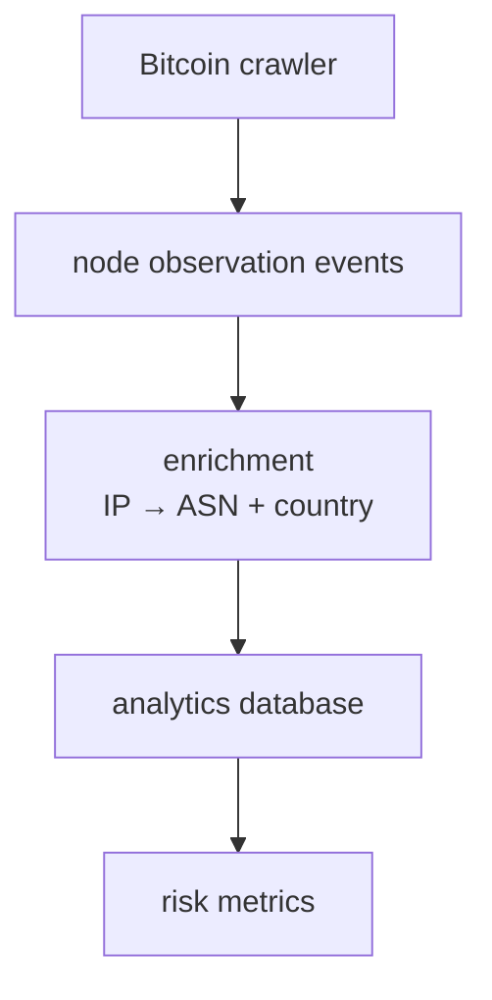

# BNDD-001 - btc-network

| Field | Value |
| --- | --- |
| Doc ID | `BNDD-0001` |
| Title | `btc-network` |
| Status | `implemented` |
| Scope | `project direction` |
| Last updated | `2026-03-15` |
| Related docs | `../../agents/architecture-decisions.md`, `../../agents/frontend-architecture.md` |

## Human Observations

Future design docs can reuse this table with the same fields so each document starts with a compact, consistent header.

- BNDD = Bitcoin Network Design Doc

## Contents

- [Project Scope](#project-scope)
- [Current Repository Shape](#current-repository-shape)
- [Currently Implemented Capabilities](#currently-implemented-capabilities)
- [Architecture](#architecture)
- [Current Crawler Behavior](#current-crawler-behavior)
- [Current Limitation](#current-limitation)
- [Why Add Historical Storage and Enrichment](#why-add-historical-storage-and-enrichment)
- [Design Direction for the Next Phase](#design-direction-for-the-next-phase)
- [IP Enrichment Strategy](#ip-enrichment-strategy)
- [Risk Analysis Goals](#risk-analysis-goals)
- [Data Model Direction](#data-model-direction)
- [Reachability and Confidence Model](#reachability-and-confidence-model)
- [Crawler Happy Path](#crawler-happy-path)
- [Roadmap](#roadmap)
- [Local Usage](#local-usage)
- [Design Notes](#design-notes)
- [References](#references)

--- 

## Project Scope

A research-focused Bitcoin P2P implementation in Rust, with a possible crawler/observability expansion path for Bitcoin network analysis.

This repository already implements the core pieces needed to talk to Bitcoin peers directly over the wire protocol: handshake, peer discovery, header sync, and block download. One possible next phase is to turn crawler output into a durable dataset that supports decentralization and network-risk analysis without weakening the project’s protocol-first boundaries.


`btc-network` has two complementary tracks:

1. **Protocol-first Bitcoin networking in Rust**
   - implement Bitcoin P2P primitives and workflows directly over TCP
   - expose them through a shared Rust library, CLI flows, crawler, listener, desktop shell, and web UI

2. **Crawler-driven network observability**
   - discover reachable peers over time
   - capture node state from handshake metadata
   - enrich discovered IPs with ASN and country data
   - build a historical dataset for centralization and eclipse-risk-oriented analysis

The second track should build on top of the protocol implementation rather than redefining the repository around crawler-specific concerns.

## Current Repository Shape

This repository is organized as a Rust workspace plus UI applications:

- `crates/btc-network` contains the shared protocol, wire, session, client, and crawler logic
- `apps/cli` exposes single-peer workflows such as handshake, ping, address discovery, header sync, and block fetch
- `apps/crawler` explores the network recursively from Bitcoin DNS seeds
- `apps/listener` is a dedicated executable crate in the workspace
- `apps/desktop` is the Tauri desktop shell
- `apps/web` is the web-first frontend
- `docs/` contains architecture, fundamentals notes and design docs that will be written throughout the development process.

## Currently Implemented Capabilities

The repository already supports:

- `version` / `verack`
- BIP155 `addrv2`
- `getaddr`
- `getheaders`
- header decoding
- header hashing (`dSHA256`)
- iterative sync to peer tip
- block download

At the app level, the CLI and desktop/web surfaces already expose workflows such as:

- handshake
- ping
- peer address discovery
- last known block height
- block summary
- block download

## Architecture

The core implementation is intentionally layered:

```text
TcpStream
   ↓
wire (message envelope, framing, decoding)
   ↓
session (handshake + state machine)
   ↓
client/crawler workflows
   ↓
apps (cli, crawler, listener, desktop, web)
```

This layering is important because the risk-analysis work should build on the shared library and crawler workflows instead of introducing project-specific logic directly into the UI or app entrypoints.

## Current Crawler Behavior

Today, the crawler starts from Bitcoin DNS seed nodes and recursively expands the reachable network by:

1. connecting to a peer
2. performing the Bitcoin handshake
3. requesting peer addresses with `getaddr`
4. accepting `addrv2` or `addr`
5. storing node state from the peer `version` response
6. deduplicating discovered peers by `SocketAddr`
7. scheduling newly discovered endpoints into the shared frontier

The crawler currently exposes operational controls such as:

- max concurrency
- max runtime
- idle timeout
- connect timeout
- I/O timeout
- verbose logging

It also emits a summary including:

- scheduled tasks
- successful handshakes
- failed tasks
- total queued nodes
- unique discovered nodes
- captured node states
- elapsed runtime

## Current Limitation

The current crawler is still **in-memory only**. A future extension would need a repository layer for crawler persistence and state storage.

That limitation is the main gap between the current implementation and a full observability/risk-analysis system.

## Why Add Historical Storage and Enrichment

A simple recursive `getaddr` crawler is enough to build a useful network census, but it is not enough for longitudinal analysis.

To analyze the Bitcoin network over time, the system needs to preserve more than the latest in-memory crawl state.

The crawler output should evolve into two persistent views:

- **raw observations**: each observation captured at a point in time
- **current state**: the latest known state per endpoint or node identity

This enables metrics such as:

- infrastructure concentration
- hosting concentration
- version adoption
- churn
- transport mix
- conditions that may increase eclipse-attack risk

## Design Direction for the Next Phase

The next phase should extend the current crawler architecture with four additional responsibilities:

1. **normalization**
2. **enrichment**
3. **persistence**
4. **analytics**

### Normalization

Normalize all discovered endpoints before persistence.

Examples:

- canonical `ip:port`
- explicit network type such as `ipv4`, `ipv6`, `torv2`, `torv3`, `i2p`, `cjdns`
- consistent formatting for non-IP address families supported by `addrv2`

### Enrichment

For routable IPv4 and IPv6 addresses, enrich the endpoint with external metadata such as:

- ASN
- ASN organization
- country
- prefix grouping

For Tor and other overlay-network addresses, store the network type, but do not try to geolocate them like ordinary IP addresses.

### Persistence

Introduce a repository/storage layer so crawler runs can be analyzed historically instead of only in memory.

### Analytics

Build metrics on top of persisted observations rather than computing everything directly inside the crawl loop.

## IP Enrichment Strategy

This project should rely on public MMDB datasets rather than rebuilding IP intelligence from scratch.

Planned source:

- [`sapics/ip-location-db`](https://github.com/sapics/ip-location-db)

This repository publishes downloadable CSV and MMDB variants for country, city, and ASN datasets, including GeoLite2, IPtoASN, DB-IP Lite, RouteViews-derived, and combined variants. That makes it a practical fit for a crawler pipeline that needs local lookups and periodic refreshes.

Recommended minimum enrichment setup for this project:

- ASN MMDB for `IP -> ASN, ASN organization`
- country MMDB for `IP -> country`

City-level enrichment is not required for the first useful version.

### Why ASN matters more than country

Country is helpful, but ASN is usually the stronger decentralization signal.

Examples:

- many nodes in the same country may still be distributed across many operators
- many nodes in the same ASN or hosting provider indicate tighter infrastructure concentration

For Bitcoin risk analysis, ASN concentration is typically more meaningful than country alone.

## Risk Analysis Goals

This project should not try to “detect an eclipse attack in real time” from crawler data alone.

Instead, it should measure **conditions that increase network fragility or eclipse feasibility**.

### High-value metrics

A practical first set of metrics includes:

- `top_asn_share`
- `top_5_asn_share`
- `asn_entropy`
- `top_country_share`
- `country_entropy`
- `largest_prefix_cluster`
- `tor_share`
- `ipv6_share`
- `outdated_version_share`
- `new_nodes_24h`
- `short_lived_nodes_7d`
- `reachable_to_rumored_ratio`

### Why these metrics matter

- **ASN concentration** helps reveal hosting-provider or infrastructure centralization
- **prefix clustering** helps reveal dense subnet concentration and possible Sybil-like grouping
- **version distribution** shows upgrade health and outdated node share
- **transport mix** shows dependency on IPv4, IPv6, or Tor
- **churn** helps identify unstable or suspiciously short-lived node populations
- **reachable vs rumored** distinguishes verified observations from gossip-only data

## Data Model Direction

The current crawler captures node state from the `version` response. That should evolve into a more explicit observation model.

A useful observation record may include:

- `observed_at`
- `endpoint`
- `network_type`
- `ip_or_overlay_address`
- `port`
- `services`
- `user_agent`
- `protocol_version`
- `start_height`
- `handshake_status`
- `first_seen`
- `last_seen`
- `asn`
- `asn_org`
- `country`
- `prefix`
- `confidence_level`

## Reachability and Confidence Model

Not all discovered addresses should be treated the same.

The system should distinguish between:

- **reachable nodes**: nodes that completed handshake successfully
- **rumored nodes**: nodes only seen in `addr` / `addrv2` gossip

Recommended confidence labels:

- `verified_handshake`
- `gossiped_only`
- `seen_by_n_peers`
- `recently_verified`
- `recent_connection_failed`

This is important because Bitcoin address gossip may be stale, noisy, or adversarial.

## Crawler Happy Path - High Level

The target crawler shape for this project is:



## Roadmap

### Near term

- keep improving protocol correctness and shared workflows
- introduce crawler persistence/repository layer
- persist handshake-derived node state
- persist discovered peer observations
- add enrichment step for IPv4/IPv6 endpoints

### Medium term

- compute historical metrics from stored observations
- add reports and visualizations for ASN concentration, version adoption, and churn
- expose analytics in desktop/web views

### Longer term

- compare observations across multiple crawler vantage points
- improve confidence scoring and suspected-staleness handling
- evaluate more advanced topology and network-risk research ideas

## Local Usage

### User Interface

- `make desktop-dev`
- `make web-dev`

### CLI

Ping a node:

```bash
make cli ARGS="--node seed.bitcoin.sipa.be:8333 ping"
```

Request peer addresses:

```bash
make cli ARGS="--node seed.bitcoin.sipa.be:8333 get-addr"
```

Fetch headers from genesis:

```bash
make cli ARGS="--node seed.bitcoin.sipa.be:8333 get-headers"
```

Get peer tip using iterative header sync:

```bash
make cli ARGS="--node seed.bitcoin.sipa.be:8333 last-block-header"
```

Download a block:

```bash
make cli ARGS="--node seed.bitcoin.sipa.be:8333 download-block --hash <block-hash>"
```

### Crawler

Run with defaults:

```bash
make crawler
```

Or:

```bash
cargo run -p btc-network-crawler
```

Run with custom limits:

```bash
cargo run -p btc-network-crawler -- --max-concurrency 500 --max-runtime-minutes 20 --idle-timeout-minutes 3 --verbose
```

## Design Notes

This design doc intentionally reflects both:

- the **current state** of the repository
- one **design direction** for turning the crawler into a durable observability and risk-analysis system

That means some parts above describe implemented behavior today, while others describe a future direction that still needs to be weighed against the protocol-first project goals.

## References

- Bitcoin P2P developer reference: <https://developer.bitcoin.org/devguide/p2p_network.html>
- Bitcoin P2P message reference: <https://developer.bitcoin.org/reference/p2p_networking.html>
- BIP 155 (`addrv2`): <https://bips.dev/155/>
- `sapics/ip-location-db`: <https://github.com/sapics/ip-location-db>
